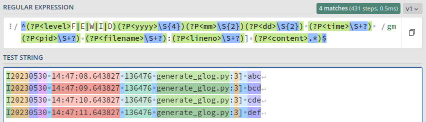
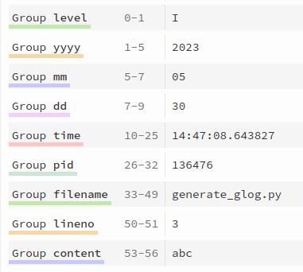
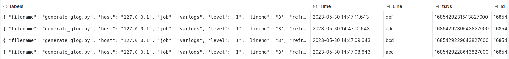

# Promtail Configuration for Google Logging Prefix Format

**regex** 

[copy && more detail of this regex](https://regex101.com/r/dFcVGX/1)

**match information**

**grafana**

Thanks to 
[Promtail Pipeline 日志处理配置](https://mp.weixin.qq.com/s?__biz=MzU4MjQ0MTU4Ng==&mid=2247492144&idx=1&sn=a1cc13a6423fe50173856bfc898e8d77&chksm=fdbaed2dcacd643b0d3e5a8ff66053f3872077faf1c2a0624b9ea5db0eca82a6ff75034080fe&cur_album_id=1837018771652149250&scene=190#rd) 
and
[Loki日志分析平台调研报告](https://cookie1loki2search.netlify.app/).
